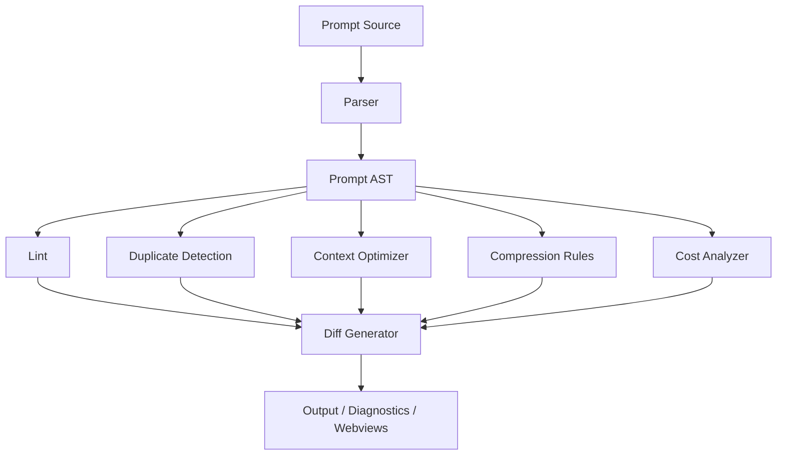

# PromptGuard v2 Architecture

## Purpose

PromptGuard v2 keeps the current VS Code extension intact while making the prompt workflow more structured, explainable, and modular. The goal is to add richer prompt intelligence without breaking the existing local-first analysis, onboarding, dashboard, or history behavior.

## Existing Architecture

### Extension activation flow

Activation starts in `src/extension.ts`, which acts as the composition root. It creates the analyzer, history store, optimization ledger, Groq client/gateway, refinement service, onboarding gate, trace logger, decorations, navigator tree provider, execution pipeline, and the dashboard/comparison panels.

The extension wires commands, chat participants, language model provider registration, tree view refresh, and all webview entry points from this single module. In practice, `src/extension.ts` orchestrates the product rather than owning analysis logic.

### Commands

Current commands include:

- Analyze current prompt
- Preview optimization
- Open dashboard
- Show history
- Open chat / local chat panel
- Complete onboarding
- Reset onboarding and caches
- Show runtime info
- Configure Groq
- Toggle path mode
- Preferences / settings
- Logout
- Delete account and local data

Commands are implemented in the extension activation flow and mostly dispatch into the pipeline, onboarding, dashboard, or refinement modules.

### Providers and views

PromptGuard exposes:

- A tree view provider in the Activity Bar via `NavigatorProvider`
- A VS Code chat participant via `PromptGuardParticipant`
- A language model chat provider for Groq via `GroqModelProvider`
- Editor decorations via `IssueDecorations`

These are lightweight presentation layers. They do not own business rules; they surface the results of the analyzer or pipeline.

### Webviews

Current webviews are:

- `PromptChatPanel` for local prompt analysis in a panel
- `RefinementPanel` for cleanup / expand / minimize workflows
- `OptimizationComparisonPanel` for side-by-side optimization preview
- `Dashboard` for analytics, history, and project-level summaries
- The cloud verification/onboarding webview inside `PromptGuardApi`

The webviews are already separate enough to preserve compatibility, but they are still tightly coupled to current data-shape assumptions.

### Storage

PromptGuard uses three storage patterns:

- `workspaceState` for local history and UI state
- `globalState` for consent and policy version tracking
- `SecretStorage` for the session token
- A local JSON ledger at `.promptguard/prompt-optimizations.json` with backups

Cloud-related prompt logging is opt-in and project-scoped. Local history is capped and queryable, while the ledger records cumulative token reduction and savings.

### Prompt analysis pipeline

The primary analysis path is:

1. Input prompt arrives from editor, chat participant, or local panel.
2. `PromptAnalyzer` runs deterministic heuristic rules from `src/heuristics/rules.ts`.
3. `PromptScorer` computes the quality score and breakdown.
4. `CostEstimator` estimates tokens, output tokens, latency, and cost.
5. `PromptOptimizer` generates a lightweight optimization suggestion.
6. `PromptExecutionService` combines the local analysis with onboarding, optional Groq judgement, history persistence, ledger persistence, and trace logging.

The local analyzer is the core of the current product. Groq is an enhancement layer rather than the only source of truth.

### Token estimation

Token estimation is currently heuristic-based:

- Local token estimate is roughly character-count based in `CostEstimator` and related workflows.
- When a chat model exposes `countTokens`, PromptGuard uses that exact count in chat analysis.
- Cost estimation depends on `promptguard.modelPricing` when a matching profile exists.

This means the current token numbers are useful for guidance, but they are not a full parser-based token model.

### Optimization pipeline

Current optimization is split across:

- `PromptOptimizer` for simple local rewrite suggestions
- `RefinementService` for cleanup, expand, and minimize flows
- `GroqGateway` for optional Groq-based clarification and compression
- `OptimizationComparisonPanel` for before/after inspection

The existing pipeline is intentionally non-destructive: it previews changes, records them in history, and does not silently replace the user prompt.

### Current UI

The current UI is functional and explainable:

- Editor decorations underline issue spans
- Hover messages explain the problem and suggest a fix
- Chat participant returns analysis summaries
- Dashboard shows quality score, findings, history, and savings
- Refinement and comparison panels expose prompt changes explicitly

The visual language is closer to a utility dashboard than a full prompt IDE. It is readable, but not yet a full AST-driven developer toolchain.

### Current limitations

Observed limitations in the current design:

- Prompts are still mostly treated as raw strings
- Token estimation is heuristic, not AST-aware
- Rewrite quality depends on a single Groq-backed path for cloud rewrite flows
- Analysis and optimization are not yet unified under a single prompt model
- Duplicate detection and context pruning are limited
- Diagnostics are surfaced in UI, but not integrated with the Problems panel as first-class VS Code diagnostics
- Policies, templates, budget mode, analytics, and learning are not yet formal modules
- Incremental analysis while typing is not yet a core architecture primitive

## Weak Points

1. **String-first processing**
   - The system analyzes the prompt as raw text and only later converts results into score/cost/history entries.
   - This makes section-aware reasoning, duplicate detection, and selective rewrites harder than necessary.

2. **Mixed responsibilities in the current orchestration layer**
   - `src/extension.ts` handles activation, command dispatch, onboarding actions, dashboard actions, and pipeline wiring.
   - That is workable today, but it becomes difficult to extend safely as new modules are added.

3. **Optimization model quality is bounded**
   - Current rewrite behavior is useful but not strong enough for broader restructuring.
   - The product needs clearer separation between deterministic rewriting and optional model-assisted rewrite paths.

4. **No prompt AST boundary**
   - There is no structural representation for Role, Context, Task, Constraints, Examples, Output Format, Notes, or Metadata.
   - This blocks future linting, duplication scoring, heatmaps, and budget enforcement from being truly section-aware.

5. **Metrics are cumulative but not always normalized**
   - Current savings and totals can be useful, but repeated runs and mixed estimate methods can make transparency harder.

6. **Feature growth risk**
   - The requested roadmap is broad enough that without strong module boundaries, the extension could become a large monolithic prompt engine.

## Proposed Architecture

PromptGuard v2 should be layered, with a stable orchestration surface and modular analyzers underneath.

### Target layering

1. **Entry layer**
   - Commands, chat participant, tree view, webviews, and editor decorations.

2. **Prompt model layer**
   - Parser
   - AST
   - Section metadata
   - Incremental token/ambiguity/redundancy scoring

3. **Analysis layer**
   - Lint rules
   - Duplicate detection
   - Context optimizer
   - Policy validation
   - Budget checks
   - Dead-code elimination recommendations

4. **Optimization layer**
   - Deterministic compression rules
   - Template extraction
   - Diff generation
   - Optional AI-assisted rewrites behind feature flags

5. **Presentation layer**
   - Problems panel diagnostics
   - Heatmap decorations
   - Token profiler view
   - Diff view
   - Dashboard / analytics

6. **Persistence and telemetry layer**
   - Local history
   - Optimization ledger
   - Privacy-first learning store
   - Trace summaries

### Proposed module boundaries

- `PromptParser` produces a structured AST.
- `PromptAstAnalyzer` consumes the AST and emits lint, redundancy, and cost signals.
- `PromptCompressionEngine` applies deterministic rewrite rules and records savings.
- `PromptDiffService` builds a Git-style before/after diff.
- `PromptBudgetService` checks project budgets in real time.
- `PromptPolicyService` loads and validates `promptguard.json`.
- `PromptLearningService` records only opt-in learning signals.
- `PromptTelemetryAdapter` exposes safe, summarized event hooks.

### Target runtime flow

## Migration Plan

The migration should be incremental and backward compatible.

### Phase 0: Stabilize boundaries

- Keep current commands, dashboard, onboarding, and history intact.
- Add feature flags for all new modules.
- Preserve local-first behavior by default.

### Phase 1: Prompt AST

- Introduce a parser that converts prompt text into a structured tree.
- Preserve raw text input as the source of truth.
- Make AST creation optional and non-breaking for existing analyzers.
- Completed module should add deterministic section detection, line numbers, token estimates, importance, ambiguity, and duplicate scores per node.

### Phase 2: Diagnostics and token intelligence

- Build lint rules on top of the AST.
- Add incremental token profiling and heatmap display.
- Surface diagnostics in the Problems panel without removing current editor decorations.
- Completed module should cache per-section metrics, expose totals, token-by-section breakdown, estimated costs, latency, most expensive section, and potential savings.

### Phase 3: Deterministic optimization

- Move compression into a dedicated rules engine.
- Show every optimization as a preview with reason, savings, confidence, and diff.
- Keep all modifications explicit and user-approved.

### Phase 4: Templates, policies, analytics, learning

- Add organization policies, templates, budget mode, analytics, and privacy-first learning.
- Keep these as optional modules with workspace and global scopes where appropriate.

### Phase 5: Optional AI augmentation

- Introduce stronger rewrite models behind feature flags.
- Use AI only after deterministic rules, and only when the user explicitly allows it.

## Risks

1. **Architecture drift**
   - Without strict module boundaries, the extension could become harder to maintain than the current design.

2. **Performance regressions**
   - Real-time AST parsing and incremental analysis must stay fast enough for typing-time feedback.

3. **User trust issues**
   - Silent rewrites, inaccurate token savings, or unclear optimization behavior would damage trust quickly.

4. **Privacy and policy risk**
   - Any learning or telemetry feature must remain opt-in and prompt-content safe by default.

5. **Compatibility risk**
   - Existing commands, dashboard flows, onboarding, and history must continue to work during migration.

6. **Scope risk**
   - The requested feature set is large; doing too much in one step would increase breakage and make testing harder.

## Summary

PromptGuard today is a strong local-first prompt governance extension with a solid analyzer, scoring pipeline, onboarding flow, dashboard, and optional Groq integration. PromptGuard v2 should preserve that base while adding a structured prompt model, modular analyzers, explainable optimization, and incremental intelligence.

The guiding principle should be: **keep the current product working, add structure underneath it, and expose every optimization explicitly**.