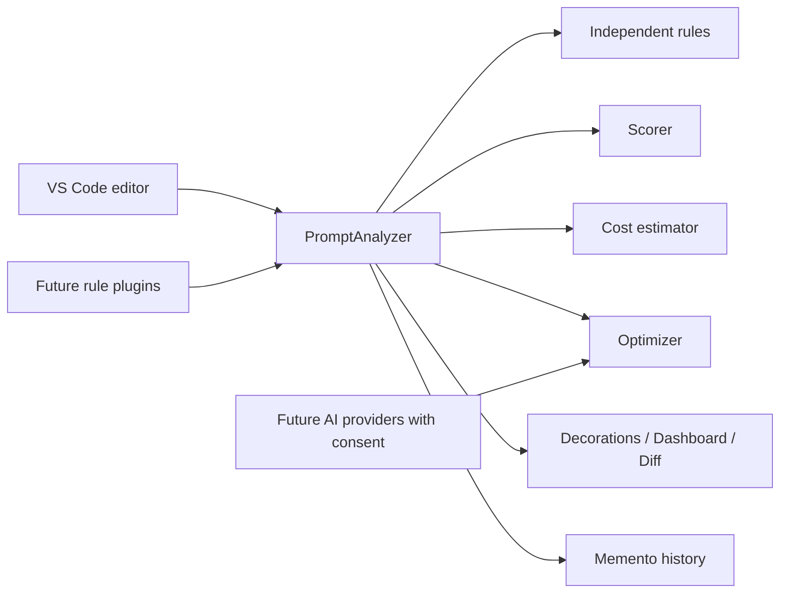

# PromptGuard

PromptGuard is a local-first prompt governance extension for VS Code. It brings linting, quality scoring, cost awareness, safety checks, and optimization previews to the prompt-writing workflow.

## What it does

- Runs deterministic prompt analysis locally; prompts are never uploaded.
- Scores context, specificity, constraints, examples, formatting, safety, efficiency, and maintainability.
- Detects ambiguity, missing role/format/constraints, repetition, injection patterns, potential secrets, and PII.
- Estimates tokens, cost, latency, and savings; stores searchable local history.
- Profiles live token usage while typing and shows token-by-section detail.
- Warns while typing when workspace budget limits are exceeded and suggests fixes automatically.
- Detects duplicated ideas across semantic prompt blocks and suggests merges.
- Detects unnecessary context and suggests removable paragraphs without deleting anything automatically.
- Estimates prompt dead code elimination candidates such as repeated emphasis, redundant adjectives, duplicate instructions, unused context, and long introductions.
- Supports workspace, team, and global prompt templates with variables and snippet expansion.
- Validates workspace prompt policy rules from promptguard.json.
- Browses workspace policy packs from promptguard.policy-packs.json.
- Supports simplified workspace promptguard.json policies with max tokens, output requirements, secret blocking, and constraint checks.
- Validates workspace token, cost, and latency budgets from promptguard.budget.json.
- Budget mode warns live while typing when max tokens, cost, or latency are exceeded.
- Simulates prompt cost across multiple providers with configurable workspace pricing and monthly/yearly usage estimates.
- Provides an in-extension PromptGuard Settings panel for common preferences without manual JSON edits.
- Browses workspace prompt templates from promptguard.templates.json.
- Stores opt-in local learning summaries without raw prompt text.
- Runs workspace benchmark suites from promptguard.benchmarks.json.
- Exports workspace audit reports with team analytics into .promptguard/audit-reports.
- Browses opt-in provider guidance for Groq, OpenAI, Claude, and Gemini from promptguard.providers.json.
- Manages provider opt-in state in promptguard.providers.json.
- Exports browser-friendly and JetBrains-friendly prompt handoff artifacts with target-specific next steps.
- Provides editor decorations, hover explanations, quick fixes, a Git-style optimization diff view, sidebar navigation, and a Chart.js dashboard.
- Adds prompt analytics with average tokens, ambiguity, redundancy, quality, savings, cost, and trend charts.
- Adds `@promptguard /analyze` to VS Code Chat. It analyzes chat prompts locally and uses the selected model's tokenizer when the provider exposes one.

## Chat integration and model costs

In VS Code Chat, type `@promptguard /analyze` followed by the prompt you want to assess. Pressing Enter submits the request to PromptGuard and returns the score, safety findings, and token information inside Chat.

VS Code does **not** expose a global before-send/Enter interception API for other extensions' chat participants. That means PromptGuard cannot inspect, block, or alter a prompt sent directly to Copilot, Claude, Codex, or another provider. A regular extension can only handle chat turns it owns. This design intentionally protects chat-provider boundaries and user privacy.

When the selected chat model exposes `countTokens`, PromptGuard displays an exact input-token count. Pricing is provider- and contract-specific, so it is intentionally configured locally rather than guessed. Add a profile to `promptguard.modelPricing`, for example:

```json
"promptguard.modelPricing": [
  { "match": "gpt-4.1", "inputPerMillionUsd": 2, "outputPerMillionUsd": 8 },
  { "match": "claude", "inputPerMillionUsd": 3, "outputPerMillionUsd": 15 }
]
```

PromptGuard matches `match` against VS Code's selected-model vendor, ID, and family. It calculates `inputTokens × inputPrice + estimatedOutputTokens × outputPrice`, divided by one million. If the model has no token counter it labels the input count as estimated; if no profile matches it shows cost as unavailable rather than inventing a price.

## Optional Groq review and improvement

PromptGuard uses local deterministic analysis by default. When a local `GROQ_API_KEY` is configured, it also sends every analyzed prompt to Groq for a strict semantic quality judgement and uses that judgement as the displayed overall score. This means prompts leave VS Code for Groq, so do not enable it for confidential prompts unless your organization permits that transfer. Without a key, PromptGuard remains fully local.

To enable it, copy `.env.example` to `.env` and set a newly generated `GROQ_API_KEY`. The `.env` file is ignored by Git. Press **Improve prompt with Groq** in the dashboard to explicitly generate a revised prompt. Short prompts receive at most two targeted questions, each with an **Other** free-text option. Long prompts skip questions and use one compression pass to preserve the intended output while removing redundant tokens. Identical semantic judgements are cached for 30 minutes, and background saves use local rules only.

## Cloud prompt logging onboarding

Prompt logging is opt-in. When `promptguard.apiBaseUrl` is configured, the first extension activation asks for permission to collect the user's email address, selected project context, original prompts, and any generated improved prompts. After consent, the extension verifies the email with the PromptGuard API's OTP flow, asks the user to create or choose a project, and stores the 24-hour bearer token in VS Code Secret Storage.

Configure the deployed API URL in VS Code settings:

```json
"promptguard.apiBaseUrl": "https://your-promptguard-api.example"
```

The extension never contains the MongoDB URI or API email-provider secrets.

## Install and run locally

```bash
npm install
npm run compile
```

Open this folder in VS Code and press `F5` to start an Extension Development Host. Select prompt text (or open a prompt document) and run **PromptGuard: Analyze Current Prompt** from the Command Palette.

## Commands

| Command | Purpose |
| --- | --- |
| `PromptGuard: Analyze Current Prompt` | Runs local rules and opens analytics. |
| `PromptGuard: Preview Optimization` | Opens the non-destructive Git-style optimization diff view. |
| `PromptGuard: Open Dashboard` | Shows quality, costs, rule findings, and prompt analytics trends. |
| `PromptGuard: Settings` | Opens the PromptGuard settings panel for preferences, runtime toggles, and cost simulator defaults. |
| `PromptGuard: Open Cost Simulator` | Compares provider pricing, projected usage, latency, and optimization savings. |
| `PromptGuard: Open Dead Code Elimination` | Estimates likely dead instructions, impact level, and potential token savings. |
| `PromptGuard: Show History` | Searches local prompt snapshots. |
| `PromptGuard: Browse Policy Packs` | Opens the workspace policy pack catalog. |
| `PromptGuard: Run Benchmark Suites` | Evaluates workspace benchmark cases and opens a markdown report. |
| `PromptGuard: Export Audit Report` | Writes a markdown audit export and opens it in the editor. |
| `PromptGuard: Browse Opt-In Providers` | Opens guidance for Groq, OpenAI, Claude, and Gemini provider setup. |
| `PromptGuard: Manage Provider Opt-In` | Enables or disables OpenAI, Claude, or Gemini in the workspace catalog. |
| `PromptGuard: Browse Prompt Templates` | Reviews reusable templates, scopes, and repeated prompt prefixes. |
| `PromptGuard: Insert Template Snippet` | Inserts a template with snippet placeholders into the active editor. |
| `PromptGuard: Convert Current Prompt to Template` | Generates a reusable template from a repeated prompt prefix. |
| `PromptGuard: Export Prompt Handoff` | Exports browser or JetBrains handoff artifacts for the current prompt. |
| `PromptGuard: Open Context Optimizer` | Highlights unrelated context, estimated savings, and review-only removal suggestions. |
| `PromptGuard: Open Duplicate Detection` | Shows similar semantic blocks, estimated savings, and a merge suggestion. |

## Workspace Policy

Create a `promptguard.json` file in the workspace root to enforce organization policy rules. The simplified format below is supported and is checked automatically by the editor lint pipeline and by `PromptGuard: Validate Workspace Policy`.

```json
{
  "maxTokens": 1000,
  "requireOutput": true,
  "forbidSecrets": true,
  "requireConstraints": true
}
```

`maxTokens` flags prompts that are too long, `requireOutput` requires an explicit output shape, `forbidSecrets` blocks secret-like strings, and `requireConstraints` requires an explicit constraint or requirement section.

## Settings Panel and Cost Simulator Input

Use `PromptGuard: Settings` to manage common preferences like analysis mode, minimum prompt length, learning store, profiler, budget mode, and default monthly runs for cost simulation.

`PromptGuard: Open Cost Simulator` now works even if no prompt is open:

- If a prompt is selected/open, PromptGuard uses that text.
- If not, PromptGuard offers to use the last analyzed prompt.
- You can also paste prompt text directly in an input box.

`PromptGuard: Open Dead Code Elimination` also works even if no prompt is open:

- If a prompt is selected/open, PromptGuard uses that text.
- If not, PromptGuard offers to use the last analyzed prompt.
- You can also paste prompt text directly in an input box.

## Architecture



PromptGuard now uses a deterministic prompt AST internally before analysis. The AST keeps the raw prompt compatible with existing rules while preparing the codebase for section-aware linting, duplicate detection, and structured optimization in later modules.

The live token profiler adds a separate incremental path: it reads the AST, caches section metrics, and updates a status bar summary plus a live profiler panel while the user types.

Rules live in `src/heuristics` and implement `PromptRule`; integrations implement `ModelProvider`. This keeps cloud providers (OpenAI, Anthropic, Gemini), policy controls, CI linting, and marketplace plugins behind stable seams.

## Automation

- Run `npm run check` to execute typecheck, compile, and tests in the same order used by local hooks and CI.
- Run `npm run install-hooks` once to configure Git to use the repository hooks in `.githooks`.
- GitHub Actions runs the same checks from `.github/workflows/ci.yml` on push and pull request.

## Screenshots

_Dashboard and optimization-diff screenshots will be added before marketplace release._

## Roadmap

- Prompt benchmark suites and evaluation criteria
- Dead code elimination tuning and scoring heuristics
- Enterprise policy packs, team analytics, and audit exports
- Cost simulator presets and richer provider pricing guidance
- Opt-in OpenAI, Claude, and Gemini providers
- Git hooks, CI/CD prompt linting, and GitHub Actions
- Browser and JetBrains extensions

## Contributing

Run `npm run typecheck` and `npm run compile` before submitting a pull request. Add rules as isolated classes, avoid network access in the analysis path, and maintain strict TypeScript types.

## License

MIT. See [LICENSE](LICENSE).
