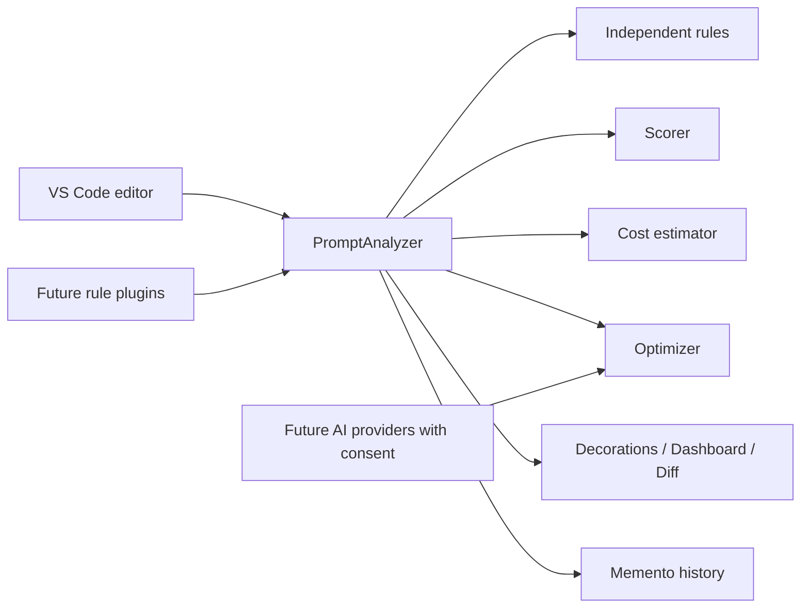

# PromptGuard

PromptGuard is a local-first prompt governance extension for VS Code. It brings linting, quality scoring, cost awareness, safety checks, and optimization previews to the prompt-writing workflow.

## What it does

- Runs deterministic prompt analysis locally; prompts are never uploaded.
- Scores context, specificity, constraints, examples, formatting, safety, efficiency, and maintainability.
- Detects ambiguity, missing role/format/constraints, repetition, injection patterns, potential secrets, and PII.
- Estimates tokens, cost, latency, and savings; stores searchable local history.
- Provides editor decorations, hover explanations, quick fixes, a diff preview, sidebar navigation, and a Chart.js dashboard.
- Adds `@promptguard /analyze` to VS Code Chat. It analyzes chat prompts locally and uses the selected model's tokenizer when the provider exposes one.

## Chat integration and model costs

In VS Code Chat, type `@promptguard /analyze` followed by the prompt you want to assess. Pressing Enter submits the request to PromptGuard and returns the score, safety findings, and token information inside Chat.

VS Code does **not** expose a global before-send/Enter interception API for other extensions' chat participants. That means PromptGuard cannot inspect, block, or alter a prompt sent directly to Copilot, Claude, Codex, or another provider. A regular extension can only handle chat turns it owns. This design intentionally protects chat-provider boundaries and user privacy.

When the selected chat model exposes `countTokens`, PromptGuard displays an exact input-token count. Pricing is provider- and contract-specific, so it is intentionally configured locally rather than guessed. Add a profile to `promptguard.modelPricing`, for example:

```json
"promptguard.modelPricing": [
  { "match": "gpt-4.1", "inputPerMillionUsd": 2, "outputPerMillionUsd": 8 },
  { "match": "claude", "inputPerMillionUsd": 3, "outputPerMillionUsd": 15 }
]
```

PromptGuard matches `match` against VS Code's selected-model vendor, ID, and family. It calculates `inputTokens × inputPrice + estimatedOutputTokens × outputPrice`, divided by one million. If the model has no token counter it labels the input count as estimated; if no profile matches it shows cost as unavailable rather than inventing a price.

## Optional Groq review and improvement

PromptGuard uses local deterministic analysis by default. When a local `GROQ_API_KEY` is configured, it also sends every analyzed prompt to Groq for a strict semantic quality judgement and uses that judgement as the displayed overall score. This means prompts leave VS Code for Groq, so do not enable it for confidential prompts unless your organization permits that transfer. Without a key, PromptGuard remains fully local.

To enable it, copy `.env.example` to `.env` and set a newly generated `GROQ_API_KEY`. The `.env` file is ignored by Git. Press **Improve prompt with Groq** in the dashboard to explicitly generate a revised prompt. Short prompts receive at most two targeted questions, each with an **Other** free-text option. Long prompts skip questions and use one compression pass to preserve the intended output while removing redundant tokens. Identical semantic judgements are cached for 30 minutes, and background saves use local rules only.

## Cloud prompt logging onboarding

Prompt logging is opt-in. When `promptguard.apiBaseUrl` is configured, the first extension activation asks for permission to collect the user's email address, selected project context, original prompts, and any generated improved prompts. After consent, the extension verifies the email with the PromptGuard API's OTP flow, asks the user to create or choose a project, and stores the 24-hour bearer token in VS Code Secret Storage.

Configure the deployed API URL in VS Code settings:

```json
"promptguard.apiBaseUrl": "https://your-promptguard-api.example"
```

The extension never contains the MongoDB URI or API email-provider secrets.

## Install and run locally

```bash
npm install
npm run compile
```

Open this folder in VS Code and press `F5` to start an Extension Development Host. Select prompt text (or open a prompt document) and run **PromptGuard: Analyze Current Prompt** from the Command Palette.

## Commands

| Command | Purpose |
| --- | --- |
| `PromptGuard: Analyze Current Prompt` | Runs local rules and opens analytics. |
| `PromptGuard: Preview Optimization` | Opens a non-destructive Git-style diff. |
| `PromptGuard: Open Dashboard` | Shows quality, costs, and rule findings. |
| `PromptGuard: Show History` | Searches local prompt snapshots. |

## Architecture



Rules live in `src/heuristics` and implement `PromptRule`; integrations implement `ModelProvider`. This keeps cloud providers (OpenAI, Anthropic, Gemini), policy controls, CI linting, and marketplace plugins behind stable seams.

## Screenshots

_Dashboard and optimization-diff screenshots will be added before marketplace release._

## Roadmap

- Prompt benchmark suites and evaluation criteria
- Enterprise policy packs, team analytics, and audit exports
- Opt-in OpenAI, Claude, and Gemini providers
- Git hooks, CI/CD prompt linting, and GitHub Actions
- Browser and JetBrains extensions

## Contributing

Run `npm run typecheck` and `npm run compile` before submitting a pull request. Add rules as isolated classes, avoid network access in the analysis path, and maintain strict TypeScript types.

## License

MIT. See [LICENSE](LICENSE).
