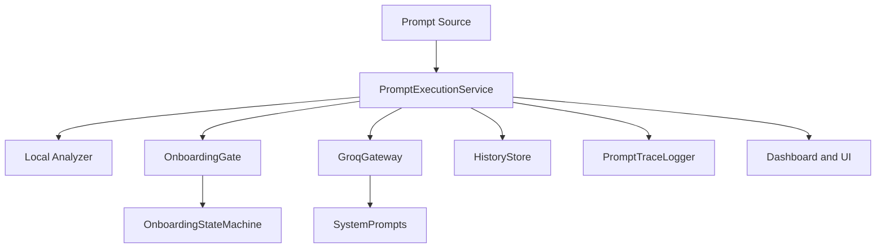

# PromptGuard Refactored Architecture

## Objectives

- Keep prompt analysis local-first and deterministic.
- Decouple onboarding state management from prompt interception.
- Centralize Groq optimization prompts for consistency.
- Capture traceable prompt lifecycle events with token deltas.

## Runtime Flow

1. Prompt enters from editor command, local chat panel, or chat participant.
2. `PromptExecutionService` runs local analysis and scoring.
3. `OnboardingGate` executes a deterministic onboarding check.
4. If authorized and configured, Groq semantic judgement is applied.
5. Result and token delta are traced in `PromptTraceLogger`.
6. History entry is persisted and dashboard surfaces updated.

## Current Key Modules

- `src/services/pipeline/promptExecutionService.ts`
- `src/services/onboarding/onboardingGate.ts`
- `src/services/onboarding/onboardingStateMachine.ts`
- `src/services/tracing/promptTraceLogger.ts`
- `src/integrations/groq/systemPrompts.ts`
- `src/integrations/groq/groqGateway.ts`

## Onboarding State Machine

Mapped states:

- `idle`
- `api-unconfigured`
- `policy-pending`
- `verification-pending`
- `project-pending`
- `activated`
- `api-error`

Mapped API stages:

- `api-unconfigured`
- `consent-denied`
- `session-cancelled`
- `session-ready`
- `policy-recorded`
- `project-ready`
- `api-error`

## Tracing Contract

`PromptTraceLogger` emits phases:

- `start`
- `local-analysis`
- `groq-skip` or `groq-judgement` or `groq-failed`
- `persisted`
- `end`

Recommended trace fields:

- `source`
- `scoreSource`
- `beforeTokens`
- `afterTokens`
- `tokenDelta`
- `onboardingState`
- `onboardingStage`
- `apiStatus`

## Groq Prompt Standardization

All system prompts live in `src/integrations/groq/systemPrompts.ts`:

- `GROQ_REVIEW_SYSTEM_PROMPT`
- `GROQ_JUDGEMENT_SYSTEM_PROMPT`
- `GROQ_CLARIFY_SYSTEM_PROMPT`
- `GROQ_TOKEN_MINIMIZER_SYSTEM_PROMPT`

Token minimization flow now expects strict JSON preservation flags before accepting compressed output.

## Migration Checklist

1. Keep `src/extension.ts` as composition root only.
2. Move onboarding dialogs to dedicated UI classes (`src/ui/dialogs`) in next phase.
3. Add unit tests for:
   - onboarding state transitions
   - token optimizer JSON parsing and fallback
   - prompt execution trace emission
4. Add integration tests for first-time onboarding and cancelled OTP flows.
5. Add a telemetry adapter boundary to forward trace summaries when opt-in telemetry is enabled.

## Mermaid View

